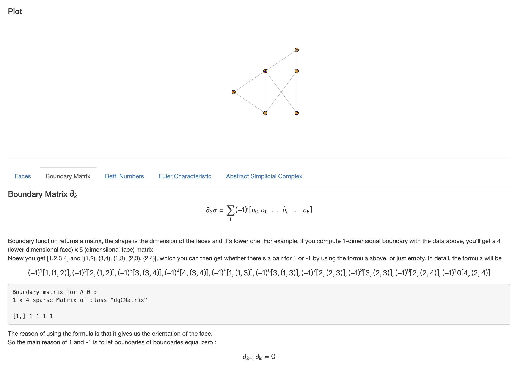

# Topological Data Analysis: Simplicial Complex
This package aims to provide a user-friendly TDA application. Although many TDA libraries, such as Dionysus, PHAT, and GUDHI, have been developed in Python and C++, I believe it would be valuable to implement simplicial complex functionality in R, making it compatible with the wide range of statistical methods available in R.

## Goals
1. This package will continue adding useful knowledge in the playground to help both me and the users understand the methods.
2. Since this package computes simplicial complexes, more applications for example, persistence diagrams, are expected in future versions.

**Example code**
```R
# Get its' simplices by specific epsilon
points <- matrix(c(0, 1, 1, 0, 0, 0, 1, 1), ncol = 2)
epsilon <- 1.5
vr_complex <- VietorisRipsComplex(points, epsilon)

# You can find its' topology feature by using these functions
faces(vr_complex$simplices, target_dim=1)
boundary(vr_complex$simplices, 1)
betti_number(vr_complex$simplices, 1, tol=0.1)
euler_characteristic(simplices, tol=0.1)
abstract_simplicial_complex(simplices, 2)

# Plot the Vietoris-rips complex
plot(
  vr_complex$network,
  layout = points,
  vertex.label = 1:nrow(points),
  vertex.size = 12,
  edge.arrow.mode = 0,
  asp = 1
)

```

**Playground**<br/>
Try this [playground](https://tf3q5u-0-0.shinyapps.io/mapperalgo/) to get familier with all of the concept that will be used in TDA.<br/>
